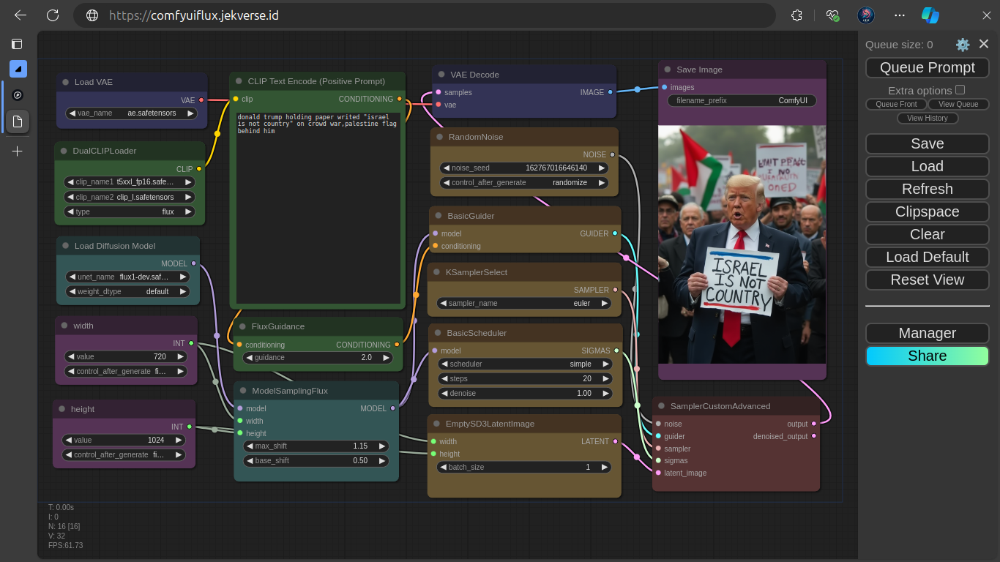

# 🚀 Welcome to the ComfyUI Flux Dev FP16 Paperspace Setup


**Warning:** This repo is strictly for the daring souls who are using Paperspace Gradient and aiming to set up ComfyUI with the *Flux Dev FP16* model. 💡

## ⚠️ Important Note:
Before you get too excited, make sure you're wielding a GPU that's **NOT below an A4000**. Yes, I’m looking at you, with your budget GPU. Trust me, it won’t end well. Save yourself some tears. 💧

## Why This Repo Exists
This repo has a simple mission: **To save your wallet** and **make it easier to install ComfyUI with the Flux model on Paperspace**. Usually, when you’re setting up stuff on Paperspace, you get hit with some **persistent storage fees**. Fear not! This repo sidesteps that nightmare by running outside the `notebooks` and `storage` directories. 🎉

But—and this is a big "but"—it also means this setup isn’t saved when you’re done. No storage, no charge, no persistence. It’s like a party that disappears at dawn. 🌅

## 🛠️ What’s Included?
- **Virtual Environment** – We use a Python virtual environment here, so no more messy dependency conflicts. Let’s keep it clean, people. 🧼
- **ComfyUI-Manager** – That’s right, you’re getting the manager too.
- **Public URL with Ngrok** – To use ComfyUI online, we are using ngrok to make Local URL to be Public URL

## 🚀 Installation Instructions

1. Open your Paperspace terminal (seriously, just do it).
2. Run the following command like a boss:
   
   ```bash
   chmod +x setup.sh && ./setup.sh
   ```

3. Wait a bit—grab a coffee if you must—and eventually, a local URL will appear in your terminal.

4. Congrats! 🎉 You’re now running **ComfyUI**. Just clik the url that appears on Terminal Output You’re welcome. 🎩

## 🖼️ Drag-and-Drop Magic (aka Workflow)
Want to use it? Easy peasy. Just download the image below, and then drag and drop it into your ComfyUI interface. Voila! 🪄


---

Thanks for stopping by my repo! I’m Jek, and I hope you stay healthy always. 😊

---
